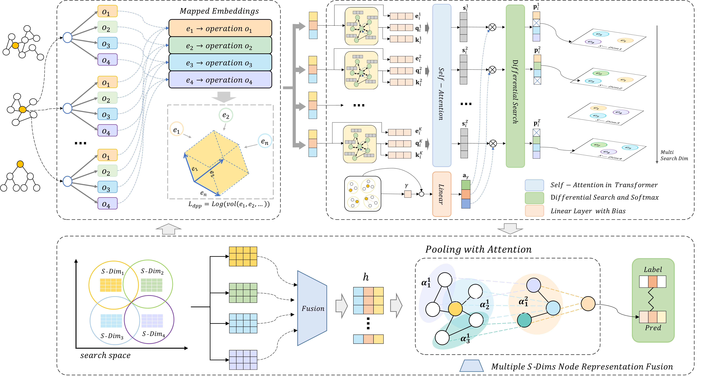

# AMDGAS

This code implements and evaluates the AMDGAS method described in paper "Assortativity Attention Based Multi-Dim Graph Neural Architecture Search Under Distribution Shifts". 



# Abstract
Graph neural architecture search (GraphNAS) has demonstrated significant advantages in automatically designing graph neural network architectures for graph classification tasks.
However, a major limitation of GraphNAS is its vulnerability to distribution shifts, where the optimal architectures searched for training graphs may not generalize well to unseen testing graphs. 
Recent approaches have addressed this issue by tailoring neural architectures for each graph through differentiable search and weight sharing.
Nevertheless, these methods are constrained by the number of candidate operations and neglect the importance of extracting node link patterns to distinguish different distributions.
In this paper, we propose Assortativity-attention-based Multi-Dim Graph neural Architecture Search (AMDGAS), which tailors architectures end-to-end for each graph with unknown distribution from multiple search dimensions. 
Specifically, we extend the vertical depth of the architecture search space, defining multiple parallel search dimensions.
Different dimensions share an operation-embedding mapping, enabling the model to conduct a multi-dimension search within single-dimension complexity.
In addition, we model node link patterns and propose assortativity attention, which captures the regularities of graph distributions and guides architecture search across different dimensions while cutting off architecture subspaces that may have negative impacts under particular distributions.
Experimental results on synthetic and real-world datasets with distribution shifts demonstrate that 
our proposed method surpasses state-of-the-art algorithms and achieves excellent out-of-distribution generalization. 
# Datasets

Generate the **Spurious Motif** and **Spurious Motif*** datasets:
```
python spmotif_gen/spmotif_gener.py 
``` 
[Datasets source](https://github.com/Wuyxin/DIR-GNN)

Other datasets are generated via [PyG](https://pytorch-geometric.readthedocs.io/en/latest/modules/datasets.html).

# Graph Classification

Run graph classification experiments:
```
nohup python graph_search.py --seed 4210 --jieduan 4 --useac True --device '1' --dataset_str 'sp' --sp_b '0.7' > experiment_samesize/sp_0.7_jieduan4/seed=4210.txt &
nohup python graph_search.py --seed 4215 --jieduan 4 --useac True --device '1' --dataset_str 'hiv' --epochs 100 > experiment_newsp/hiv_jieduan4/seed=4215.txt &
``` 
To get the mean and standard deviation reported in our paper:
```
nohup ./run_samesize.sh > output.log 2>&1 &
nohup ./run_mol.sh > output.log 2>&1 &
``` 
# Community Detection

Run community detection experiments:
```
python Comm/gs_comm.py 
``` 
To get the mean and standard deviation reported in our paper:
```
nohup ./Comm/cluster_GNNs_comm.sh > output.log 2>&1 &
``` 
